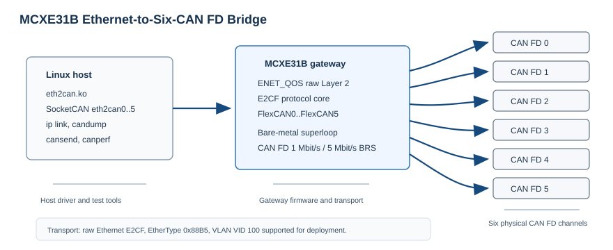
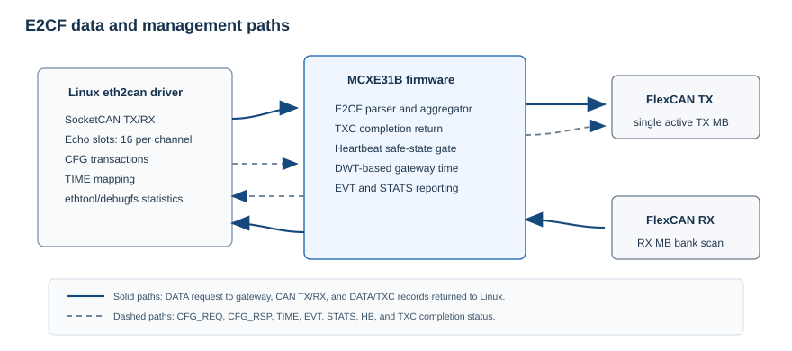

# NXP Application Code Hub
[](https://www.nxp.com)

## MCXE31B Ethernet-to-Six-CAN FD Bridge
[中文说明](README.zh-CN.md)

This project implements an Ethernet-to-six-CAN FD bridge based on the NXP
MCXE31B. A Linux host loads the `eth2can.ko` driver and sees six standard
SocketCAN interfaces, `eth2can0` through `eth2can5`. Existing SocketCAN tools
and applications can then send and receive CAN FD frames through the MCXE31B
gateway.

The basic architecture is outlined below:



* **Linux SocketCAN driver:** `eth2can.ko` binds to one Ethernet interface,
  exchanges raw E2CF Layer-2 frames with the gateway, and exposes six CAN FD
  channels as SocketCAN devices.
* **MCXE31B gateway firmware:** The bare-metal firmware receives E2CF Ethernet
  frames, forwards CAN FD traffic through FlexCAN0..FlexCAN5, reports status,
  and supervises the heartbeat between Linux and the gateway.
* **Customer validation tool:** `canperf` provides latency and bidirectional
  maximum sustainable bandwidth checks for the default six-channel harness.

#### Boards: MCXE31B gateway board
#### Categories: Tools
#### Peripherals: CAN FD, Ethernet
#### Toolchains: MDK, GCC

## Table of Contents
1. [Software](#step1)
2. [Hardware](#step2)
3. [Setup](#step3)
4. [Results](#step4)
5. [FAQs](#step5)
6. [Support](#step6)
7. [Release Notes](#step7)

## 1. Software<a name="step1"></a>

This repository contains the MCXE31B firmware, Linux driver, validation tool,
and design notes required to bring up the bridge.

Project classification and description:

| Project | Path | Description |
|---|---|---|
| MCXE31B firmware | `source/`, `board/` | Bare-metal bridge firmware using ENET_QOS raw Layer-2 Ethernet and FlexCAN0..FlexCAN5 |
| Linux driver | `linux/` | Out-of-tree SocketCAN driver, installer script, and driver tests |
| canperf | `linux/can_testcase/` | Customer latency and bidirectional bandwidth validation tool |
| Design notes | `docs/*.md` | E2CF protocol, Linux driver, firmware, and EQOS TX design documentation |

Default bridge configuration:

| Item | Default |
|---|---|
| Host API | SocketCAN devices `eth2can0` through `eth2can5` |
| Ethernet transport | Raw Layer-2 E2CF, EtherType `0x88B5` |
| Deployment VLAN | VID `100`; untagged frames are allowed during bring-up |
| CAN FD nominal bitrate | 1 Mbit/s |
| CAN FD data bitrate | 5 Mbit/s |
| CAN FD BRS | Enabled |
| TX window | 16 echo/TXC slots per CAN channel |
| MCU-to-Linux aggregation | Record-count based or 50 us timer |
| Heartbeat supervision | 100 ms period, 500 ms timeout |

### Software Protocol

E2CF is a little-endian raw Ethernet protocol shared by the Linux driver and
the MCXE31B firmware. The frame EtherType is `0x88B5`. The protocol carries
CAN frame data, CAN transmit-completion status, configuration transactions,
events, time mapping, heartbeat, and statistics.

Message types used by this delivery:

| Type | Direction | Purpose |
|---|---|---|
| DATA | Both directions | CAN frames or Linux transmit requests |
| TXC | MCXE31B to Linux | CAN transmit completion and echo-slot release |
| EVT | MCXE31B to Linux | CAN state and error events |
| CFG_REQ / CFG_RSP | Linux to MCXE31B / MCXE31B to Linux | Channel configuration and status transactions |
| TIME | MCXE31B to Linux | Gateway time mapping |
| HB | Both directions | Peer discovery and heartbeat supervision |
| STATS | MCXE31B to Linux | Gateway counters for diagnostics and validation |



For protocol details, see
[`docs/e2cf-protocol-spec.md`](docs/e2cf-protocol-spec.md).

## 2. Hardware<a name="step2"></a>

Use one MCXE31B gateway board, one Linux host connected to the gateway Ethernet
port, and six external CAN FD transceivers.

Default CAN FD harness:

```text
eth2can0 <-> eth2can4
eth2can1 <-> eth2can2
eth2can3 <-> eth2can5
```

Each pair is one independent CAN FD bus. Use 120 ohm termination at both ends,
keep CANH/CANL polarity correct, power the transceivers, and share ground with
the gateway board.

### Pin Table

The table below lists the primary CAN, Ethernet, and debug UART connections
used by this project.

| Function | MCU signal | Package pin | Description |
|---|---|---:|---|
| CAN0 TX/RX | PTA7 / PTA6 | 100 / 102 | CAN0 transceiver TXD/RXD |
| CAN1 TX/RX | PTA11 / PTA12 | 160 / 159 | CAN1 transceiver TXD/RXD |
| CAN2 TX/RX | PTE24 / PTE25 | 157 / 158 | CAN2 transceiver TXD/RXD |
| CAN3 TX/RX | PTC28 / PTC29 | 96 / 99 | CAN3 transceiver TXD/RXD |
| CAN4 TX/RX | PTC30 / PTC31 | 101 / 103 | CAN4 transceiver TXD/RXD |
| CAN5 TX/RX | PTC27 / PTC26 | 93 / 91 | CAN5 transceiver TXD/RXD |
| RMII MDIO/MDC | PTB4 / PTB5 | 48 / 47 | Ethernet PHY management |
| RMII data/control | PTC2, PTD7, PTD12, PTC17, PTC1, PTC0, PTD11 | 50, 51, 54, 65, 61, 62, 55 | Ethernet RMII signals |
| PHY reset | PTC3 | 49 | Ethernet PHY reset GPIO |
| Debug UART RX/TX | PTE3 / PTE14 | 27 / 26 | Debug console |

Status LED behavior:

| LED | State | Meaning |
|---|---|---|
| SYS | About 1 Hz blinking | Firmware superloop is running |
| NET | Solid on | Ethernet/E2CF link is ready |
| CAN | Blinking | CAN RX/TX traffic is active |
| CAN | Solid on | At least one active CAN bus is error-passive or bus-off |

## 3. Setup<a name="step3"></a>

Before getting started, prepare a Linux host with SocketCAN support, matching
kernel headers or a matching kernel build tree, and common tools such as
`make`, `gcc`, `kmod`, `iproute2`, and `can-utils`.

### 3.1 Step 1

Program or confirm the MCXE31B gateway firmware. If the board is already
programmed, power it up. To build the firmware yourself, open
`e2cf_mcxe31.uvprojx` in Keil MDK, build the MCXE31B target, and program the
board with your normal MCXE31B/SWD flow.

### 3.2 Step 2

Connect the Linux host to the MCXE31B Ethernet port. Connect the default CAN FD
harness:

```text
eth2can0 <-> eth2can4
eth2can1 <-> eth2can2
eth2can3 <-> eth2can5
```

### 3.3 Step 3

Build and load the Linux driver from the repository root:

```bash
$ sh linux/scripts/install_driver.sh
```

Common variants:

```bash
$ sh linux/scripts/install_driver.sh --ifname eth1 --vid 100
$ KDIR=/path/to/kernel/build sh linux/scripts/install_driver.sh --ifname end0
$ sh linux/scripts/install_driver.sh --dry-run
$ sh linux/scripts/install_driver.sh --require-gateway
```

The installer builds `eth2can.ko`, loads it for the current boot, waits for the
gateway heartbeat, and configures `eth2can0..5` for CAN FD 1M/5M. It does not
install DKMS, systemd units, or persistent autoload configuration.

### 3.4 Step 4

Confirm the SocketCAN devices:

```bash
$ ip -details link show type can
```

Six interfaces, `eth2can0` through `eth2can5`, should be present.

### 3.5 Step 5

Run a basic CAN FD transmit check:

```bash
$ candump eth2can4 &
$ cansend eth2can0 123##3001122334455667788
```

If `eth2can4` receives the frame, the Linux driver, Ethernet transport,
MCXE31B firmware, and at least one physical CAN FD bus are working.

### 3.6 Step 6

Build and run the customer validation tool:

```bash
$ cd linux/can_testcase
$ make
$ ./canperf latency --count 10000
$ ./canperf bandwidth
```

## 4. Results<a name="step4"></a>

The expected first-level result is that all six SocketCAN devices are created,
the default harness passes basic `candump` / `cansend` traffic, and `canperf`
prints final `RESULT` and `EVIDENCE` lines.

Example result lines:

```bash
RESULT latency: PASS, zero_loss=yes, ...
EVIDENCE latency: ..., counters=clean
RESULT bandwidth: PASS, zero_loss=yes, MSR=... fps/pair, ...
EVIDENCE bandwidth: ..., counters=clean
```

For acceptance, use the final `RESULT` line as the customer conclusion. `PASS`
means zero-loss for that run. Latency reports p50, p99, and p99.9. Bandwidth
reports MSR, the maximum sustainable rate. `counters=clean` means relevant
driver and gateway loss, overflow, reject, and send-failure counters did not
increase during the confirmation round.

This repository does not define fixed p99 or MSR pass/fail limits. Thresholds
must be agreed for the target harness, host, and system load.

## 5. FAQs<a name="step5"></a>

* Why does the Linux host see six `eth2canN` devices instead of one raw
  Ethernet device?

  The Linux driver presents the gateway as standard SocketCAN interfaces so
  existing CAN applications can run without a custom user-space API.

* Does the MCXE31B firmware use TCP/IP or lwIP?

  No. The firmware uses ENET_QOS raw Layer-2 Ethernet and the E2CF protocol.

* Are fixed p99 latency or MSR bandwidth limits defined by this repository?

  No. The tools report measured latency, MSR, and clean/dirty counters. Final
  limits depend on the harness, Linux host, and system load.

* Is this repository an open-source release?

  No. It is not published under an open-source license in its current form.
  See the distribution notice below.

## 6. Support<a name="step6"></a>

#### Project Metadata
<!----- Boards ----->
[](https://github.com/search?q=org%3Anxp-appcodehub+MCXE31B+in%3Areadme&type=Repositories)

<!----- Categories ----->
[](https://github.com/search?q=org%3Anxp-appcodehub+tools+in%3Areadme&type=Repositories)

<!----- Peripherals ----->
[](https://github.com/search?q=org%3Anxp-appcodehub+can+fd+in%3Areadme&type=Repositories)
[](https://github.com/search?q=org%3Anxp-appcodehub+ethernet+in%3Areadme&type=Repositories)

<!----- Toolchains ----->
[](https://github.com/search?q=org%3Anxp-appcodehub+mdk+in%3Areadme&type=Repositories)
[](https://github.com/search?q=org%3Anxp-appcodehub+gcc+in%3Areadme&type=Repositories)

Questions regarding the content or correctness of this project can be entered
as Issues within this GitHub repository.

> **Warning**: For general technical questions about NXP microcontrollers,
> use the [NXP Community Forum](https://community.nxp.com/).

[](https://www.youtube.com/@NXP_Semiconductors)
[](https://www.linkedin.com/company/nxp-semiconductors)
[](https://www.facebook.com/nxpsemi/)
[](https://twitter.com/NXP)

Distribution notice: this repository is not published under an open-source
license in its current form. Copying, redistribution, product use, or
publication outside the authorized project scope requires written permission
from the repository owner. Preserve all SPDX notices in source files.

## 7. Release Notes<a name="step7"></a>

| Version | Description / Update | Date |
|:-------:|----------------------|----------------------------:|
| 1.0 | Initial release for MCXE31B Ethernet-to-six-CAN FD bridge | July 4<sup>th</sup> 2026 |
