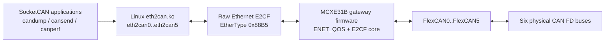

# MCXE31B Ethernet-to-Six-CAN FD Bridge

[中文说明](README.zh-CN.md)

Turn one Ethernet link from a Linux host into six standard SocketCAN CAN FD
interfaces through an NXP MCXE31B gateway.

This repository contains the MCXE31B bare-metal bridge firmware, a Linux
`eth2can` SocketCAN driver, and a customer validation tool for latency and
bidirectional bandwidth checks. It is intended for customers and field teams
who need to bring up, evaluate, and diagnose an Ethernet-to-CAN FD bridge
without changing existing SocketCAN applications.

## At a glance

| Item | Default |
|---|---|
| Host API | SocketCAN devices `eth2can0` through `eth2can5` |
| Ethernet transport | Raw Layer-2 E2CF, EtherType `0x88B5` |
| CAN FD rate | 1 Mbit/s nominal, 5 Mbit/s data phase |
| CAN FD mode | BRS enabled |
| Deployment VLAN | VID `100`; untagged frames are allowed during bring-up |
| TX window | 16 echo/TXC slots per CAN channel |
| MCU aggregation | Record-count based or 50 us timer |
| Heartbeat supervision | 100 ms period, 500 ms timeout |

## Why this matters

- Reuses the Linux SocketCAN ecosystem instead of requiring a custom user-space
  API.
- Bridges one Ethernet interface to six independent CAN FD channels.
- Keeps the Ethernet side as raw Layer-2 traffic, avoiding an IP stack on the
  MCXE31B firmware.
- Provides deterministic bring-up evidence through `canperf` `RESULT` and
  `EVIDENCE` lines.
- Separates customer bring-up documentation from detailed protocol and
  implementation notes.

## Architecture



Linux owns the customer-facing SocketCAN devices. The MCXE31B firmware owns the
ENET_QOS raw Ethernet path, E2CF parsing, FlexCAN transmit/receive, heartbeat,
status reporting, and recovery behavior.

## Repository map

| Path | Purpose |
|---|---|
| `source/` | MCXE31B bridge firmware source |
| `board/` | Board clocks, pin mux, and board initialization |
| `linux/` | Linux `eth2can.ko` driver, installer, and driver tests |
| `linux/can_testcase/` | `canperf` latency and bidirectional bandwidth tool |
| `docs/*.md` | Protocol, Linux driver, firmware, and EQOS TX design notes |

Maintainer-only automation may exist in the repository, but it is not part of
the customer bring-up path. Start with the root README and `linux/README.md`.

## Hardware prerequisites

- One MCXE31B board running the bridge firmware.
- One Linux host connected to the MCXE31B Ethernet port.
- Six external CAN FD transceivers.
- Three independent CAN FD buses for the default validation harness:

```text
eth2can0 <-> eth2can4
eth2can1 <-> eth2can2
eth2can3 <-> eth2can5
```

Each CAN FD bus needs 120 ohm termination at both ends. Verify CANH/CANL
polarity, transceiver power, and a common ground between the host setup and
the gateway board.

Status LEDs:

| LED | State | Meaning |
|---|---|---|
| SYS | About 1 Hz blinking | Firmware superloop is running |
| SYS | Solid on | Firmware is in a fault or fatal path |
| NET | Off | PHY link is down |
| NET | Blinking | PHY link is up, E2CF heartbeat is not ready yet |
| NET | Solid on | Ethernet/E2CF link is ready |
| CAN | Off | No CAN traffic |
| CAN | Blinking | CAN RX/TX traffic is active |
| CAN | Solid on | At least one active CAN bus is error-passive or bus-off |

## 5-minute validation

### 1. Prepare firmware and host

If the board is already programmed, power it up. To build the firmware
yourself, open `e2cf_mcxe31.uvprojx` in Keil MDK and build the MCXE31B target,
then program the board using your normal MCXE31B/SWD flow.

On the Linux host, make sure the running kernel has SocketCAN support and a
matching kernel build tree, usually `/lib/modules/$(uname -r)/build`.

### 2. Build and load the Linux driver

Run from the repository root:

```sh
sh linux/scripts/install_driver.sh
```

Common variants:

```sh
sh linux/scripts/install_driver.sh --ifname eth1 --vid 100
KDIR=/path/to/kernel/build sh linux/scripts/install_driver.sh --ifname end0
sh linux/scripts/install_driver.sh --dry-run
sh linux/scripts/install_driver.sh --require-gateway
```

The installer builds `eth2can.ko`, loads it for the current boot, waits for the
gateway heartbeat, and configures `eth2can0..5` for CAN FD 1M/5M. It does not
install DKMS, systemd units, or persistent autoload configuration.

Confirm the devices:

```sh
ip -details link show type can
```

### 3. Send one CAN FD frame

With the default harness connected:

```sh
candump eth2can4 &
cansend eth2can0 123##3001122334455667788
```

If `eth2can4` receives the frame, the Linux driver, Ethernet transport,
MCXE31B firmware, and at least one physical CAN FD bus are working.

### 4. Run customer acceptance tests

```sh
cd linux/can_testcase
make
./canperf latency --count 10000
./canperf bandwidth
```

Use the final `RESULT` line as the customer conclusion. `PASS` means zero-loss
for that run. Latency reports p50, p99, and p99.9. Bandwidth reports MSR,
the maximum sustainable rate. The `EVIDENCE` line is intended for reproducible
records; `counters=clean` means relevant driver and gateway loss, overflow,
reject, and send-failure counters did not increase during the confirmation
round.

This repository does not define fixed p99 or MSR pass/fail limits. Thresholds
must be agreed for the target harness, host, and system load.

## Troubleshooting quick checks

| Symptom | First checks |
|---|---|
| Kernel build tree is missing | Install headers matching `uname -r`, or pass `KDIR=/path/to/kernel/build` |
| `vermagic` mismatch | Rebuild `eth2can.ko` on the target kernel |
| No `eth2can0..5` devices | Check `dmesg`, SocketCAN kernel config, and module load errors |
| Gateway heartbeat is missing | Check cable, selected `--ifname`, VLAN path, firmware, and EtherType `0x88B5` traffic |
| CAN frame is not received | Check harness wiring, termination, transceiver power, common ground, polarity, and CAN rate |
| `counters=dirty` | Inspect `seq_lost`, `rx_ovf`, `rej`, `starv`, `sfail`, and `emac_rxdrop` deltas |

Heartbeat capture:

```sh
sudo tcpdump -eni eth0 'ether proto 0x88b5 or (vlan and ether proto 0x88b5)'
```

Expected traffic is an E2CF heartbeat every 100 ms.

## Documentation map

- Driver installation and Linux troubleshooting: [`linux/README.md`](linux/README.md)
- `canperf` build and result interpretation: [`linux/can_testcase/README.md`](linux/can_testcase/README.md)
- Protocol specification: [`docs/e2cf-protocol-spec.md`](docs/e2cf-protocol-spec.md)
- Linux driver design: [`docs/linux-driver-design.md`](docs/linux-driver-design.md)
- Firmware design: [`docs/mcxe31b-firmware-design.md`](docs/mcxe31b-firmware-design.md)
- EQOS TX handling: [`docs/eqos-tx-ring-design.md`](docs/eqos-tx-ring-design.md)

## License and distribution

This repository is not published under an open-source license in its current
form. Copying, redistribution, product use, or publication outside the
authorized project scope requires written permission from the repository owner.
Some source files carry their own SPDX notices; those notices must be
preserved.
