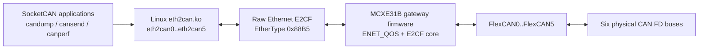

# NXP Application Code Hub
[](https://www.nxp.com)

## MCXE31B 以太网转六路 CAN FD 桥接器
[English](README.md)

本项目实现一个基于 NXP MCXE31B 的 Ethernet-to-six-CAN FD bridge。Linux 主机
加载 `eth2can.ko` 驱动后，会看到六个标准 SocketCAN 接口：`eth2can0` 到
`eth2can5`。现有 SocketCAN 工具和应用可以通过 MCXE31B 网关收发 CAN FD 帧。

基本架构如下：



* **Linux SocketCAN driver:** `eth2can.ko` 绑定一个 Ethernet 接口，通过 raw
  E2CF Layer-2 frame 与网关通信，并将六个 CAN FD 通道暴露为 SocketCAN 设备。
* **MCXE31B gateway firmware:** 裸机固件接收 E2CF Ethernet frame，通过
  FlexCAN0..FlexCAN5 转发 CAN FD 流量，上报状态，并监督 Linux 与网关之间的
  heartbeat。
* **Customer validation tool:** `canperf` 为默认六通道线束提供 latency 和
  bidirectional maximum sustainable bandwidth 验证。

#### Boards: MCXE31B gateway board
#### Categories: Tools
#### Peripherals: CAN FD, Ethernet
#### Toolchains: MDK, GCC

## Table of Contents
1. [Software](#step1)
2. [Hardware](#step2)
3. [Setup](#step3)
4. [Results](#step4)
5. [FAQs](#step5)
6. [Support](#step6)
7. [Release Notes](#step7)

## 1. Software<a name="step1"></a>

本仓库包含 MCXE31B 固件、Linux 驱动、验证工具和 bring-up 所需的设计说明。

项目分类和说明：

| Project | Path | Description |
|---|---|---|
| MCXE31B firmware | `source/`, `board/` | 使用 ENET_QOS raw Layer-2 Ethernet 和 FlexCAN0..FlexCAN5 的裸机 bridge firmware |
| Linux driver | `linux/` | Out-of-tree SocketCAN driver、安装脚本和驱动测试 |
| canperf | `linux/can_testcase/` | 客户 latency 和 bidirectional bandwidth 验证工具 |
| Design notes | `docs/*.md` | E2CF protocol、Linux driver、firmware 和 EQOS TX design documentation |

默认 bridge 配置：

| Item | Default |
|---|---|
| Host API | SocketCAN 设备 `eth2can0` 到 `eth2can5` |
| Ethernet transport | Raw Layer-2 E2CF，EtherType `0x88B5` |
| Deployment VLAN | VID `100`；bring-up 阶段允许 untagged 帧 |
| CAN FD nominal bitrate | 1 Mbit/s |
| CAN FD data bitrate | 5 Mbit/s |
| CAN FD BRS | Enabled |
| TX window | 每个 CAN 通道 16 个 echo/TXC slot |
| MCU-to-Linux aggregation | 按记录数或 50 us timer 触发 |
| Heartbeat supervision | 100 ms 周期，500 ms 超时 |

### Software Protocol

E2CF 是 Linux 驱动和 MCXE31B 固件共享的 little-endian raw Ethernet protocol。
帧 EtherType 为 `0x88B5`。协议承载 CAN frame data、CAN transmit-completion
status、configuration transaction、event、time mapping、heartbeat 和
statistics。

本交付使用的消息类型：

| Type | Direction | Purpose |
|---|---|---|
| DATA | 双向 | CAN frame 或 Linux transmit request |
| TXC | MCXE31B 到 Linux | CAN transmit completion 和 echo-slot release |
| EVT | MCXE31B 到 Linux | CAN state 和 error event |
| CFG_REQ / CFG_RSP | Linux 到 MCXE31B / MCXE31B 到 Linux | Channel configuration 和 status transaction |
| TIME | MCXE31B 到 Linux | Gateway time mapping |
| HB | 双向 | Peer discovery 和 heartbeat supervision |
| STATS | MCXE31B 到 Linux | 用于 diagnostics 和 validation 的 gateway counters |

协议细节见 [`docs/e2cf-protocol-spec.md`](docs/e2cf-protocol-spec.md)。

## 2. Hardware<a name="step2"></a>

使用一块 MCXE31B gateway board、一台连接到网关 Ethernet 口的 Linux host，以及
六路外部 CAN FD transceiver。

默认 CAN FD 线束：

```text
eth2can0 <-> eth2can4
eth2can1 <-> eth2can2
eth2can3 <-> eth2can5
```

每组是一条独立 CAN FD 总线。总线两端各使用 120 ohm 终端，CANH/CANL 极性
正确，transceiver 供电正常，并与 gateway board 共地。

### Pin Table

下表列出本项目使用的主要 CAN、Ethernet 和 debug UART 连接。

| Function | MCU signal | Package pin | Description |
|---|---|---:|---|
| CAN0 TX/RX | PTA7 / PTA6 | 100 / 102 | CAN0 transceiver TXD/RXD |
| CAN1 TX/RX | PTA11 / PTA12 | 160 / 159 | CAN1 transceiver TXD/RXD |
| CAN2 TX/RX | PTE24 / PTE25 | 157 / 158 | CAN2 transceiver TXD/RXD |
| CAN3 TX/RX | PTC28 / PTC29 | 96 / 99 | CAN3 transceiver TXD/RXD |
| CAN4 TX/RX | PTC30 / PTC31 | 101 / 103 | CAN4 transceiver TXD/RXD |
| CAN5 TX/RX | PTC27 / PTC26 | 93 / 91 | CAN5 transceiver TXD/RXD |
| RMII MDIO/MDC | PTB4 / PTB5 | 48 / 47 | Ethernet PHY management |
| RMII data/control | PTC2, PTD7, PTD12, PTC17, PTC1, PTC0, PTD11 | 50, 51, 54, 65, 61, 62, 55 | Ethernet RMII signals |
| PHY reset | PTC3 | 49 | Ethernet PHY reset GPIO |
| Debug UART RX/TX | PTE3 / PTE14 | 27 / 26 | Debug console |

状态灯行为：

| LED | State | Meaning |
|---|---|---|
| SYS | 约 1 Hz 闪烁 | Firmware superloop 正在运行 |
| NET | 常亮 | Ethernet/E2CF link ready |
| CAN | 闪烁 | CAN RX/TX traffic active |
| CAN | 常亮 | 至少一路 active CAN bus 处于 error-passive 或 bus-off |

## 3. Setup<a name="step3"></a>

开始前，准备一台带 SocketCAN 支持的 Linux host，安装与当前内核匹配的 kernel
headers 或 kernel build tree，并准备 `make`、`gcc`、`kmod`、`iproute2` 和
`can-utils` 等常用工具。

### 3.1 Step 1

烧录或确认 MCXE31B gateway firmware。如果板卡已预烧录，直接上电。需要自行
构建固件时，使用 Keil MDK 打开 `e2cf_mcxe31.uvprojx`，构建 MCXE31B target，
并按现有 MCXE31B/SWD 流程烧录。

### 3.2 Step 2

将 Linux host 连接到 MCXE31B Ethernet 口。连接默认 CAN FD 线束：

```text
eth2can0 <-> eth2can4
eth2can1 <-> eth2can2
eth2can3 <-> eth2can5
```

### 3.3 Step 3

在仓库根目录构建并加载 Linux driver：

```bash
$ sh linux/scripts/install_driver.sh
```

常用变体：

```bash
$ sh linux/scripts/install_driver.sh --ifname eth1 --vid 100
$ KDIR=/path/to/kernel/build sh linux/scripts/install_driver.sh --ifname end0
$ sh linux/scripts/install_driver.sh --dry-run
$ sh linux/scripts/install_driver.sh --require-gateway
```

安装脚本会构建 `eth2can.ko`，在当前启动周期加载模块，等待 gateway heartbeat，
并将 `eth2can0..5` 配置为 CAN FD 1M/5M。脚本不会安装 DKMS、systemd unit
或持久化 autoload 配置。

### 3.4 Step 4

确认 SocketCAN 设备：

```bash
$ ip -details link show type can
```

应能看到 `eth2can0` 到 `eth2can5` 六个接口。

### 3.5 Step 5

运行基础 CAN FD transmit check：

```bash
$ candump eth2can4 &
$ cansend eth2can0 123##3001122334455667788
```

如果 `eth2can4` 收到该帧，说明 Linux driver、Ethernet transport、MCXE31B
firmware 以及至少一条物理 CAN FD 总线可工作。

### 3.6 Step 6

构建并运行客户验证工具：

```bash
$ cd linux/can_testcase
$ make
$ ./canperf latency --count 10000
$ ./canperf bandwidth
```

## 4. Results<a name="step4"></a>

第一层期望结果是：六个 SocketCAN 设备创建成功，默认线束通过基础
`candump` / `cansend` 流量检查，`canperf` 打印最终 `RESULT` 和 `EVIDENCE`
行。

示例结果行：

```bash
RESULT latency: PASS, zero_loss=yes, ...
EVIDENCE latency: ..., counters=clean
RESULT bandwidth: PASS, zero_loss=yes, MSR=... fps/pair, ...
EVIDENCE bandwidth: ..., counters=clean
```

客户验收先看最终 `RESULT` 行。`PASS` 表示本次运行 zero-loss。Latency 报告
p50、p99 和 p99.9；Bandwidth 报告 MSR，即 maximum sustainable rate。
`counters=clean` 表示确认轮期间相关 driver 和 gateway 的 loss、overflow、
reject、send-failure counters 没有增长。

本仓库不定义固定 p99 或 MSR pass/fail 阈值。实际阈值应根据目标线束、host 和
系统负载共同确认。

## 5. FAQs<a name="step5"></a>

* 为什么 Linux host 会看到六个 `eth2canN` 设备，而不是一个 raw Ethernet 设备？

  Linux driver 将网关呈现为标准 SocketCAN interfaces，因此现有 CAN 应用不需要
  自定义 user-space API。

* MCXE31B 固件是否使用 TCP/IP 或 lwIP？

  不使用。固件直接使用 ENET_QOS raw Layer-2 Ethernet 和 E2CF protocol。

* 仓库是否定义固定的 p99 latency 或 MSR bandwidth 限值？

  不定义。工具报告实测 latency、MSR 和 clean/dirty counters。最终限值取决于
  线束、Linux host 和系统负载。

* 这个仓库是否是开源发布？

  不是。当前形式下它不以 open-source license 发布。请见下方 distribution
  notice。

## 6. Support<a name="step6"></a>

#### Project Metadata
<!----- Boards ----->
[](https://github.com/search?q=org%3Anxp-appcodehub+MCXE31B+in%3Areadme&type=Repositories)

<!----- Categories ----->
[](https://github.com/search?q=org%3Anxp-appcodehub+tools+in%3Areadme&type=Repositories)

<!----- Peripherals ----->
[](https://github.com/search?q=org%3Anxp-appcodehub+can+fd+in%3Areadme&type=Repositories)
[](https://github.com/search?q=org%3Anxp-appcodehub+ethernet+in%3Areadme&type=Repositories)

<!----- Toolchains ----->
[](https://github.com/search?q=org%3Anxp-appcodehub+mdk+in%3Areadme&type=Repositories)
[](https://github.com/search?q=org%3Anxp-appcodehub+gcc+in%3Areadme&type=Repositories)

关于本项目内容或正确性的问题，可以在当前 GitHub 仓库中提交 Issue。

> **Warning**: 关于 NXP microcontrollers 的通用技术问题，请使用
> [NXP Community Forum](https://community.nxp.com/)。

[](https://www.youtube.com/@NXP_Semiconductors)
[](https://www.linkedin.com/company/nxp-semiconductors)
[](https://www.facebook.com/nxpsemi/)
[](https://twitter.com/NXP)

Distribution notice: 本仓库当前不以 open-source license 发布。复制、再分发、
产品使用或超出授权项目范围的公开发布，都需要获得仓库所有者的书面许可。请保留
源文件中的所有 SPDX notices。

## 7. Release Notes<a name="step7"></a>

| Version | Description / Update | Date |
|:-------:|----------------------|----------------------------:|
| 1.0 | Initial release for MCXE31B Ethernet-to-six-CAN FD bridge | July 4<sup>th</sup> 2026 |
