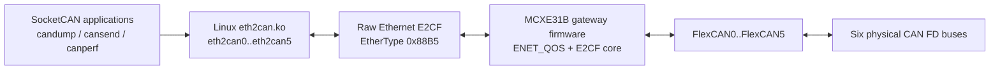

# MCXE31B 以太网转六路 CAN FD 桥接器

[English](README.md)

通过 NXP MCXE31B 网关，把 Linux 主机的一路 Ethernet 连接扩展成六个标准
SocketCAN CAN FD 接口。

本仓库包含 MCXE31B 裸机桥接固件、Linux `eth2can` SocketCAN 驱动，以及用于
延迟和双向带宽验证的客户测试工具。它面向需要 bring-up、评估和诊断
Ethernet-to-CAN FD bridge 的客户与现场团队，目标是在不修改现有 SocketCAN
应用的前提下完成接入。

## 一眼看懂

| 项目 | 默认值 |
|---|---|
| Host API | SocketCAN 设备 `eth2can0` 到 `eth2can5` |
| Ethernet transport | Raw Layer-2 E2CF，EtherType `0x88B5` |
| CAN FD rate | 仲裁相位 1 Mbit/s，数据相位 5 Mbit/s |
| CAN FD mode | BRS enabled |
| Deployment VLAN | VID `100`；bring-up 阶段允许 untagged 帧 |
| TX window | 每个 CAN 通道 16 个 echo/TXC slot |
| MCU aggregation | 按记录数或 50 us 定时器触发 |
| Heartbeat supervision | 100 ms 周期，500 ms 超时 |

## 为什么需要它

- 复用 Linux SocketCAN 生态，而不是要求客户使用自定义 user-space API。
- 通过一路 Ethernet 连接桥接六个独立 CAN FD 通道。
- MCXE31B 固件侧使用 raw Layer-2 Ethernet，不在 MCU 上运行 IP stack。
- 通过 `canperf` 的 `RESULT` 和 `EVIDENCE` 行提供可复验的 bring-up 证据。
- 将客户 bring-up 首页与协议/实现细节文档分层，避免根 README 变成手册。

## 架构



Linux 侧负责面向客户的 SocketCAN 设备。MCXE31B 固件负责 ENET_QOS raw
Ethernet 路径、E2CF 解析、FlexCAN 收发、heartbeat、状态上报和恢复行为。

## 仓库导航

| 路径 | 用途 |
|---|---|
| `source/` | MCXE31B bridge firmware source |
| `board/` | 板级时钟、pin mux 和初始化 |
| `linux/` | Linux `eth2can.ko` 驱动、安装脚本和驱动测试 |
| `linux/can_testcase/` | `canperf` 延迟和双向带宽工具 |
| `docs/*.md` | 协议、Linux 驱动、固件和 EQOS TX 设计说明 |

仓库中可能存在维护者专用自动化脚本，但这些脚本不属于客户 bring-up 路径。
请从根 README 和 `linux/README.md` 开始。

## 硬件前提

- 一块运行 bridge firmware 的 MCXE31B 板。
- 一台连接到 MCXE31B Ethernet 口的 Linux 主机。
- 六路外部 CAN FD transceiver。
- 默认验证线束使用三条独立 CAN FD 总线：

```text
eth2can0 <-> eth2can4
eth2can1 <-> eth2can2
eth2can3 <-> eth2can5
```

每条 CAN FD 总线两端各需要 120 ohm 终端。请确认 CANH/CANL 极性、transceiver
供电，以及主机测试环境与网关板之间共地。

状态灯：

| LED | 状态 | 含义 |
|---|---|---|
| SYS | 约 1 Hz 闪烁 | 固件主循环正在运行 |
| SYS | 常亮 | 固件处于 fault 或 fatal path |
| NET | 熄灭 | PHY link down |
| NET | 闪烁 | PHY link up，但 E2CF heartbeat 尚未 ready |
| NET | 常亮 | Ethernet/E2CF 链路 ready |
| CAN | 熄灭 | 无 CAN 流量 |
| CAN | 闪烁 | CAN RX/TX 流量正在通过 |
| CAN | 常亮 | 至少一路 active CAN 处于 error-passive 或 bus-off |

## 5 分钟验证路径

### 1. 准备固件和主机

如果板卡已经预烧录固件，直接上电即可。需要自行构建固件时，使用 Keil MDK
打开 `e2cf_mcxe31.uvprojx` 并构建 MCXE31B target，然后用现有 MCXE31B/SWD
流程烧录。

Linux 主机需要启用 SocketCAN，并具备与当前内核匹配的 kernel build tree，
通常为 `/lib/modules/$(uname -r)/build`。

### 2. 构建并加载 Linux 驱动

在仓库根目录运行：

```sh
sh linux/scripts/install_driver.sh
```

常用变体：

```sh
sh linux/scripts/install_driver.sh --ifname eth1 --vid 100
KDIR=/path/to/kernel/build sh linux/scripts/install_driver.sh --ifname end0
sh linux/scripts/install_driver.sh --dry-run
sh linux/scripts/install_driver.sh --require-gateway
```

安装脚本会构建 `eth2can.ko`，在当前启动周期加载模块，等待 gateway heartbeat，
并将 `eth2can0..5` 配置为 CAN FD 1M/5M。脚本不会安装 DKMS、systemd unit
或跨重启自动加载配置。

确认设备：

```sh
ip -details link show type can
```

### 3. 发送一帧 CAN FD

默认线束连接后：

```sh
candump eth2can4 &
cansend eth2can0 123##3001122334455667788
```

如果 `eth2can4` 可以收到该帧，说明 Linux 驱动、Ethernet transport、MCXE31B
固件以及至少一条物理 CAN FD 总线可工作。

### 4. 运行客户验收测试

```sh
cd linux/can_testcase
make
./canperf latency --count 10000
./canperf bandwidth
```

客户结论先看最终 `RESULT` 行。`PASS` 表示本次运行 zero-loss。延迟测试报告
p50、p99 和 p99.9；带宽测试报告 MSR，即 maximum sustainable rate。`EVIDENCE`
行用于保存可复验记录；`counters=clean` 表示确认轮期间相关驱动和网关的丢帧、
溢出、拒绝、发送失败计数器没有增长。

本仓库不定义固定 p99 或 MSR pass/fail 阈值。实际阈值应根据目标线束、主机和
系统负载共同确认。

## 快速故障排查

| 现象 | 优先检查 |
|---|---|
| 找不到 kernel build tree | 安装与 `uname -r` 匹配的 headers，或传入 `KDIR=/path/to/kernel/build` |
| `vermagic` 不匹配 | 在目标内核上重新构建 `eth2can.ko` |
| 没有 `eth2can0..5` 设备 | 检查 `dmesg`、SocketCAN 内核配置和模块加载错误 |
| Gateway heartbeat 缺失 | 检查网线、`--ifname`、VLAN 路径、固件和 EtherType `0x88B5` 流量 |
| CAN 收不到帧 | 检查线束、终端、transceiver 供电、共地、极性和 CAN 速率 |
| `counters=dirty` | 查看 `seq_lost`、`rx_ovf`、`rej`、`starv`、`sfail`、`emac_rxdrop` 增量 |

抓取 heartbeat：

```sh
sudo tcpdump -eni eth0 'ether proto 0x88b5 or (vlan and ether proto 0x88b5)'
```

期望每 100 ms 看到一次 E2CF heartbeat。

## 文档导航

- 驱动安装和 Linux 故障排查：[`linux/README.md`](linux/README.md)
- `canperf` 构建和结果解读：[`linux/can_testcase/README.md`](linux/can_testcase/README.md)
- 协议规范：[`docs/e2cf-protocol-spec.md`](docs/e2cf-protocol-spec.md)
- Linux 驱动设计：[`docs/linux-driver-design.md`](docs/linux-driver-design.md)
- 固件设计：[`docs/mcxe31b-firmware-design.md`](docs/mcxe31b-firmware-design.md)
- EQOS TX 处理：[`docs/eqos-tx-ring-design.md`](docs/eqos-tx-ring-design.md)

## 授权和发布

本仓库当前不以开源许可证发布。复制、再分发、产品使用或超出授权项目范围的
公开发布，都需要获得仓库所有者的书面许可。部分源文件带有各自的 SPDX 声明，
这些声明必须保留。
